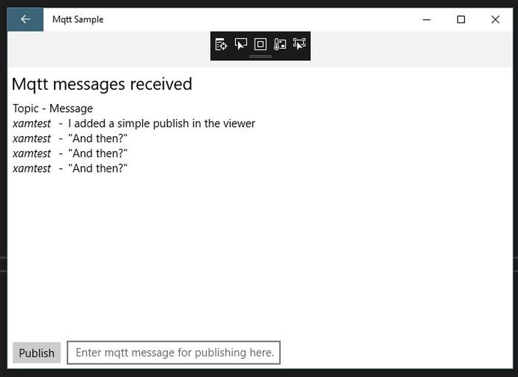

# Mqtt Sample for Xamarin.forms

## Mqtt Sammple running
Goal of the project is to secure with TLS. This just a fun little pub/sub chat app. 

In the screenshot you'll see the syntax for mosquitto_pub from the command line configured with the Mqtt Sample app settings._

Using the [wiki](https://github.com/jhalbrecht/XamarinFormsMqttSample/wiki) for documentation.

See [Wiki/ScreenShots](https://github.com/jhalbrecht/XamarinFormsMqttSample/wiki/ScreenShots) for additional page images

## Why?
I'm using this repository to learn how to secure my Xamarin.Forms applications with for example a Let's Encrypt cerfificate. In a **real world** way!

## Goal
Learn best practices / real world way(s) to install and use certificates in mobile apps supported by Xamarin.Forms UWP, android and ios
### Qs about Goal...

* Is there a platform way to;
  - access certs?
  - add new certs?

## Resources
### clients
### Mohaqeq M2Mqtt Fork
This is the client I've used in the past. This fork is a drop in my services lib. Thanks Hamidreza Mohaqeq!
The Eclipse.org paho M2Mqtt hasn't been worked on in a while..
From mohaqeq on GitHub and converted to .NET Standard 2.0 library
* [M2MqttDotnetCore ](https://www.nuget.org/packages/M2MqttDotnetCore/) NuGet
* https://github.com/mohaqeq/paho.mqtt.m2mqtt

### Reading
Help me find some great and current reading material. Maybe some videos? Again; **Looking for real world examples** of how to handle installing certificartes in 
the mobile apps UWP, Android and IOS. And then how to access them. **_Properly._**

## Gotchas
### Unlikley 
- If you configure DNS nameserver to return a hostname on a NATed ip address this code will bomb.

## Totally unOrganized - but in one place! :-)

https://code.msdn.microsoft.com/windowsapps/M2Mqtt-MQTT-client-library-ac6d3858/view/Discussions

https://stackoverflow.com/questions/18462064/associate-a-private-key-with-the-x509certificate2-class-in-net

How to create a certificate request with CertEnroll and .NET (C#)
https://blogs.msdn.microsoft.com/alejacma/2008/09/05/how-to-create-a-certificate-request-with-certenroll-and-net-c/

SSL Certificate Formats
https://www.tutorialsteacher.com/https/ssl-certificate-format

Survival guides - TLS/SSL and SSL (X.509) Certificates
http://www.zytrax.com/tech/survival/ssl.html

adrenalinehit/mqtt-subscriber.cs
https://gist.github.com/adrenalinehit/ccfeba90264a02fb629f

Sign server and client certificates

https://jamielinux.com/docs/openssl-certificate-authority/sign-server-and-client-certificates.html

OpenSSL Certificate Authority
https://jamielinux.com/docs/openssl-certificate-authority/

Associate a private key with the X509Certificate2 class in .net
https://stackoverflow.com/questions/18462064/associate-a-private-key-with-the-x509certificate2-class-in-net

Important warnings about selfsigning
https://mosquitto.org/man/mosquitto-tls-7.html

Possible useful sample

// https://gist.github.com/adrenalinehit/a4e2684a0b3b0a49b48e

https://docs.microsoft.com/en-us/dotnet/api/system.net.security.remotecertificatevalidationcallback?redirectedfrom=MSDN&view=netframework-4.7.2
     

##### This has some clues

https://github.com/eclipse/paho.mqtt.m2mqtt/issues/67